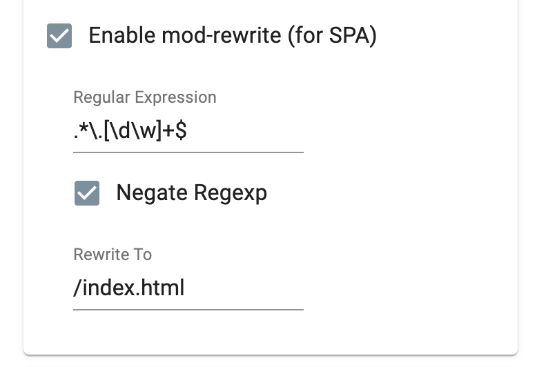

# Client side routing demonstration

This app is a prototype to a full-working client side router used in single page applications (SPA).

Loads routes on initial/refresh load and on navigating to the different links. You can use browser's back and forward button. Let's you also have dynamic URLs like `/products/:productId` for example.

## Setup

Please be aware that the condition for working SPAs is a server redirect to usually the index.html file, which calls the JavaScript router functions.

There is a .htaccess file which can be used to redirect in Apache servers.

You can also use the Chrome extension "Web Server for Chrome" and enable the following settings:

Download extension under:
https://chrome.google.com/webstore/detail/web-server-for-chrome/ofhbbkphhbklhfoeikjpcbhemlocgigb

## XSS vulnerability

In the current setup scripts can be ejected without further sanitization of the user input. This is good example. Let's make the app safer. There is an `escapeHTML` method ready to use.

<!--  -- >
<!-- https://www.urlencoder.org/ -- >
<!-- %3Cimg%20src%3D%22abc%22%20onerror%3D%22alert%28%27Hacked%20buddy%21%27%29%22%3E -- >
